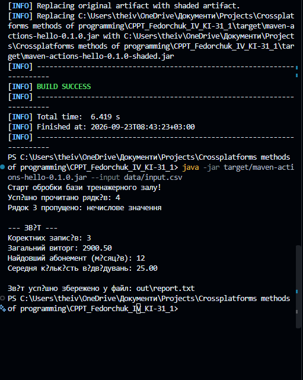

# Звіт до лабораторної роботи № 1

## 1. Тема, номер і варіант
* **Предметна область:** Тренажерний зал
* **Номер варіанта:** 20
* **Операційна система:** Windows 11 (розробка), Ubuntu/macOS/Windows (CI/CD)

## 2. Мета роботи
Пройти повний шлях від створення репозиторію й налаштування інфраструктури до версії простої консольної програми, яку можна відтворено зібрати й запустити на Windows, macOS та Ubuntu.

## 3. Постановка задачі
Створити консольний додаток, який читає записи (Клієнт; Тариф; Місяці; Відвідування; Ціна), перевіряє їх на коректність та обчислює:
1. Кількість коректних записів.
2. Загальний виторг (сума поля price).
3. Найдовший абонемент (максимум поля months).
4. Середня кількість відвідувань.

## 4. Структура програми
Програма реалізована у класі `Main` (пакет `ua.lpnu.kzp`). 
Потік даних: 
Читання `data/input.csv` -> Фільтрація хибних рядків (`try-catch` та guard clauses) -> Обчислення агрегованих метрик -> Форматування звіту (`String.format`) -> Вивід у консоль та запис у `out/report.txt`.

## 5. Інфраструктура
* **Система збірки:** Maven (запуск через Maven Wrapper для ізоляції середовища).
* **Тестування:** JUnit 5 (smoke-test для перевірки інфраструктури).
* **Статичний аналізатор:** SpotBugs (запускається на фазі `verify` для перевірки байт-коду).
* **Пакування:** `maven-shade-plugin` формує виконуваний JAR.
* **CI/CD:** GitHub Actions з матрицею (ubuntu-latest, windows-latest, macos-latest) та публікацією артефакту `.jar`.

## 6. GitHub Issues і Pull Request
| № GitHub Issue | Опис зміни |
|---|---|
| #1 | Налаштування Maven-проєкту та SpotBugs |
| #2 | Налаштування CI/CD GitHub Actions |
| #3 | Реалізація бізнес-логіки Варіанта 20 (Тренажерний зал) |
| #4 | Документація проєкту |
*(Всі Issues закриті через Pull Request #1)*

## 7. Приклади роботи

**Консольний вивід (запуск програми):**

## 8. Тестування, CI і артефакти
Локальне тестування проводилось командою `.\mvnw.cmd clean verify`.
Всі тести успішно пройшли у хмарному середовищі GitHub Actions на трьох ОС.
Зібрані артефакти доступні у вкладці Actions репозиторію.

* **Реліз:** v1.0.0

## 9. Документація
Код задокументовано з використанням `Javadoc` (описано головний клас та метод `main`). Створено `README.md` з інструкцією по запуску.

## 10. Академічна доброчесність
Цей текст і код підготовлено з використанням штучного інтелекту (Gemini) у ролі Senior DevOps Ментора.

* **Ваш внесок:** Налаштування локального середовища, виконання команд, базова імплементація логіки циклів, створення Issues та Pull Requests.
* **Внесок ШІ:** Допомога з написанням конфігурацій `pom.xml`, `ci.yml`, налаштуванням SpotBugs та рефакторинг Java-коду з поясненням архітектури.
* **Ваша відповідальність:** Я повністю розумію кожен рядок написаного коду і конфігурації.