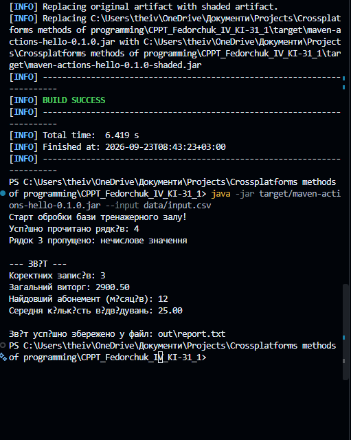

# Звіт до лабораторної роботи № 2

## 1. Тема, номер і варіант
- **Предметна область:** Тренажерний зал
- **Номер варіанта:** 20
- **Операційна система:** Windows 11 (розробка), Ubuntu/macOS/Windows (CI/CD)

## 2. Мета роботи
Рефакторинг процедурного коду обробки даних (з Лабораторної №1) з використанням принципів Об'єктно-Орієнтованого Програмування (ООП). Заміна роботи з "сирими" масивами на типізовані об'єкти, забезпечення інкапсуляції та покриття бізнес-логіки модульними тестами.

## 3. Постановка задачі
Створити об'єктно-орієнтований додаток, який читає записи (Клієнт; Тариф; Місяці; Відвідування; Ціна), перетворює їх на об'єкти та обчислює:
1. Кількість коректних записів.
2. Загальний виторг (сума поля price).
3. Найдовший абонемент (максимум поля months).
4. Середня кількість відвідувань.
Помилки формату чи некоректні дані (наприклад, від'ємні значення) повинні перехоплюватися і зберігатися в окрему колекцію для подальшого виводу, не зупиняючи роботу програми.

## 4. Структура програми
Програму розділено на три незалежні файли (пакет `ua.lpnu.kzp`):
- **`Membership.java`:** Клас-сутність (Entity). Поля інкапсульовані (`private final`). Валідація інваріантів відбувається в конструкторі. Містить фабричний метод `fromCsv` для парсингу рядків.
- **`MembershipSummary.java`:** Допоміжна структура `record` (Data Transfer Object) для безпечного зберігання та передачі фінальних розрахунків.
- **`Main.java`:** Головний клас. Потік даних: Читання `input.csv` -> створення `ArrayList<Membership>` -> агрегація метрик -> створення `MembershipSummary` -> форматування та запис звіту.

## 5. Інфраструктура
- **Система збірки:** Maven (запуск через Maven Wrapper).
- **Тестування:** JUnit 5 (тепер покриває бізнес-логіку та негативні сценарії).
- **Статичний аналізатор:** SpotBugs (запускається на фазі `verify`, виявлено та виправлено проблему невикористаних колекцій - "dead code").
- **Пакування:** `maven-shade-plugin` формує виконуваний JAR.
- **CI/CD:** GitHub Actions з матрицею (ubuntu-latest, windows-latest, macos-latest).

## 6. GitHub Issues і Pull Request
| № GitHub Issue | Опис зміни |
|---|---|
| #5 | Створення класу-сутності Membership з валідацією (Інкапсуляція) |
| #6 | Створення MembershipSummary (використання record) |
| #7 | Рефакторинг Main.java (перехід на ArrayList) |
| #8 | Написання модульних тестів (JUnit 5, патерн AAA) |
*(Всі Issues закриті через відповідні Pull Requests)*

## 7. Приклади роботи

**Консольний вивід (запуск програми):**

## 8. Тестування, CI і артефакти
Локальне тестування проводилось командою `.\mvnw.cmd clean verify`. 
Написано модульні тести для `Membership`, які покривають як "happy path", так і "negative path" (перевірка генерації `IllegalArgumentException` за допомогою `assertThrows`).
Всі тести успішно пройшли у хмарному середовищі GitHub Actions. Артефакти доступні у вкладці Actions.

- **Реліз:** v2.0.0

## 9. Документація
Код задокументовано з використанням `Javadoc`. Створено оновлений `README.md` з актуальною інструкцією по збірці та запуску програми.

## 10. Академічна доброчесність
Цей текст і код підготовлено з використанням штучного інтелекту (Gemini) у ролі Senior DevOps Ментора.

- **Ваш внесок:** Написання логіки валідації, робота з колекціями (`ArrayList`), виправлення помилок збірки (SpotBugs), написання модульних тестів, створення комітів та злиття гілок.
- **Внесок ШІ:** Пояснення принципів ООП (інкапсуляція, робота з Heap), надання каркасів (scaffolding) для класів та тестів, код-рев'ю.
- **Ваша відповідальність:** Я повністю розумію кожен рядок написаного коду, архітектурний поділ на файли та можу пояснити роботу алгоритму й тестів.